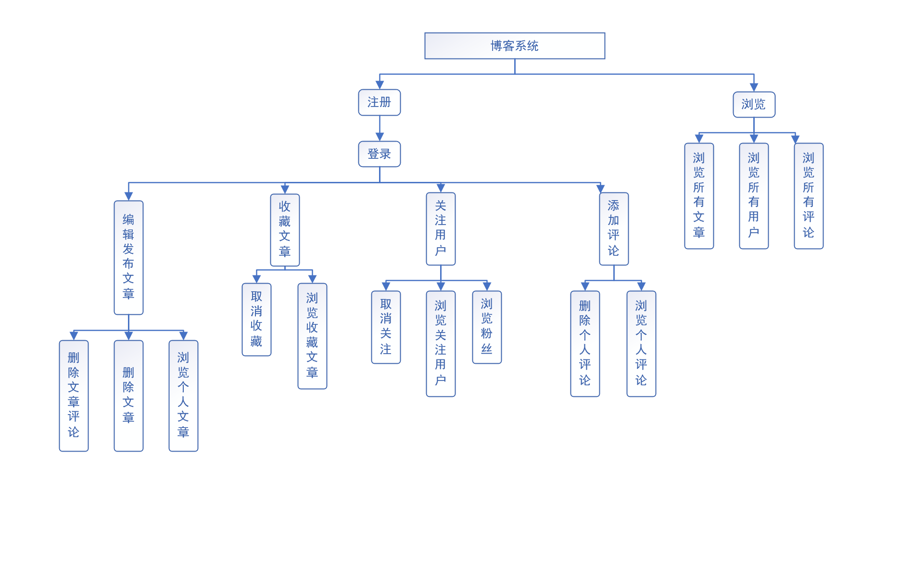

# 论文

## 摘要
随着移动互联网的发展和智能手机普及，移动端博客成为人们学习和交流的主要途径和工具。利用 Flutter 框架开发的博客系统，为用户提供移动客户端博客发布与交流平台，利用评论和功能，建立起社区文化。解决移动客户端编辑发布文章的需求。
博客系统使用Flutter作为前端框架，采用 MVVM 架构。本博客系统主要包括博文管理、用户关系管理、收藏和关注、评论管理等功能模块。利用Flutter框架的跨平台能力，同时适配Android、IOS平台。以Markdown的形式发布文章，使用 flutter_markdown插件进行文本到Markdown效果转换，使用dio插件进行网络请求，使用provider和 rxdart 插件进行状态管理。前端利用Material Design理念，实现应用对全局主题和主题模式的自定义，并支持语言的选择。后端使用Kotlin Ktor作为开发框架，数据库采用ORM框架，建立数据库表与关系，通过DAO层对数据库进行操作。
本博客系统实现了对文章内容、文章评论、用户详情的浏览功能，用户登录注册功能，登录后编辑、删除、收藏文章，登录后关注用户，登录后添加删除评论等功能。经测试功能稳定，功能具有可拓展性，响应迅速。

With the development of mobile Internet and popularization of smart phones, mobile blogs have become the main way and tool for people to learn and communicate. The blog system developed by the Flutter framework provides users with a mobile client blog publishing and communication platform, and uses comments and functions to build a community culture. Solve the needs of mobile client editing and publishing articles.
The blog system uses Flutter as the front-end framework and uses the MVVM architecture. This blog system mainly includes functional modules such as blog post management, user relationship management, collection and attention, and comment management. Take advantage of the cross-platform capabilities of the Flutter framework and adapt to both Android and IOS platforms. Post articles in the form of Markdown, use the flutter_markdown plugin for text-to-Markdown effect conversion, use the dio plugin for network requests, and use the provider and rxdart plugins for state management. The front end uses the Material Design concept to realize the customization of the global theme and theme mode by the application, and supports the choice of language. The back end uses Kotlin Ktor as the development framework, the database uses the ORM framework, establishes database tables and relationships, and operates the database through the DAO layer.
This blog system implements the browsing function of article content, article comments, user details, user login registration function, edit, delete, collect articles after login, follow users after login, add delete comments after login and other functions. The tested function is stable, the function is expandable, and the response is rapid.

## 1. 绪论

### 1.1 课题背景
在这个网络时代，人们可以通过博客系统记录自己日常发生的事情或自己感兴趣的兴趣爱好，与他人分享自己的感受，交流自己所学的知识，探讨感兴趣的话题与问题。同时结识志趣相投的朋友，建立起文化社区。同时，也有越来越多的专业知识的博客出现，使之成为学习和交流的重要工具之一。
随着智能手机的普及，移动客户端成为主流，逐渐代替pc客户端和网页版客户端。目前，移动客户端的博客系统相对较少，功能相对简单。大多数没有编辑和发布文章的能力；文章管理的体验不友好，用户不能随时随地发布最新的文章，不能及时关注最新的文章动态；该博客系统主要解决用户的此类问题。

### 1.2 意义
利用 “flutter”开发的博客系统，为用户提供在移动客户端编辑和管理文章功能。并且提供评论和收藏功能，让用户更方便的发现和专注于自己感兴趣的内容，及时获取更新。同时可以关注自己喜欢的用户，以及查看自己的粉丝，方便找到志同道合的朋友。
文章采用markdown作为文章编辑语言，以方便简洁的纯文本快速高效的编辑出样式丰富的博客内容。且存储代价小。
同时利用 “flutter框架”的跨平台能力，在一次性开发的情况下，同时适配“Android”, “IOS”等多个平台，为不同平台用户带来一致的软件体验。

### 1.3 主要内容

本博客系统主要包括博文管理、用户管理、收藏和关注、评论管理等功能模块。使用“flutter” 作为前端框架，“kotlin ktor”作为后端框架。
前端采用 mvvm 架构，高效的响应UI请求并依据数据更新UI。数据库采用ORM架构，方便数据库操作与管理。
所有请求采用http协议的get请求方式
#### 1.3.1 博文管理：
用户登录后可以编辑、发布新文章，查看自己的全部文章，删除过时的文章。
#### 1.3.2 收藏和关注：
用户登录后可以收藏或取消收藏自己喜欢的文章，关注其他用户，以及查看被哪些用户关注。
#### 1.3.3 用户管理：
用户可通过注册获得新账号。登录后可修改用户名和头像，修改头像。
#### 1.3.4 评论管理：
用户登录后可对文章进行评论，删除其他人对自己文章的评论。删除自己发表的评论。回复评论。
#### 1.3.5 基础设置：
客户端支持自定义主题，选择客户端内使用的语言。

## 2. 关键技术介绍

### 2.1 Flutter 框架
Flutter 是 Google 的一套开源的UI工具包，具有跨平台能力，在一套代码库的情况下，高效构建多平台精美应用，支持移动、Web、桌面和嵌入式等众多平台。Flutter框架开源、免费，拥有宽松的开源协议。拥有诸多优势，Flutter的热重载功能可以快速地进行测试、构建UI、添加功能并更快地修复错误。在iOS和Android模拟器或真机上可以在亚秒内重载，并且不会丢失状态。同时，Flutter内置美丽的Material Design和Cupertino（iOS风格）widget、丰富的motion API、平滑而自然的滑动效果和平台感知，为用户带来全新体验。
Flutter拥有丰富的工具和库，有助于轻松地同时在iOS和Android系统中实现想法和创意。以轻松快捷的方式来构建漂亮的移动应用程序。Flutter支持混合开发，可与现有项目并存，复用现有的Java、Kotlin、Swift等代码，访问iOS和Android上的原生系统功能和系统SDK。使用Flutter的现代、响应式框架，和一系列基础widget，轻松构建用户界面。使用功能强大且灵活的API（针对2D、动画、手势、效果等）解决艰难的UI挑战。


### 2.2 Kotlin 语言
Kotlin 语言是运行于Java虚拟机的静态类型语言，语法简洁偏向于函数式，大大减少样板代码的编写，高效开发。避免空指针异常等整个类的错误，最大化保证程序安全。同时可以复用JVM的现有库，生态强大。Kotlin 原生支持协程，于1.3版本宣布协程达到稳定。Kotlin/Native可将Kotlin代码编译为无需虚拟机就可运行的原生二进制文件，该技术是基于LLVM的Kotlin标准库的原生实现，并根据不同平台的特点，在内存管理等方面进行差异化处理，使得性能更优。
Kotlin 适用于服务端、Android、移动端跨平台、数据科学、Web开发等多种场景，并于2017年Google I/O开发者大会成为Android开发的一等语言。

### 2.3 Ktor 框架
Ktor 是一个以Kotlin作为开发语言构建异步服务器与客户端的框架，主要由服务器引擎和灵活的异步客户端两部分组成，基础框架轻量，将所有附加功能插件化，作为可选项。同时添加和配置功能方便易懂。客户端凭借Kotlin丰富的跨平台库，支持JVM，JS，Android和iOS等多平台，在跨平台移动应用程序上广泛应用。该博客系统中添加Location插件，用于获取请求中的参数，添加Gson插件便于返回Json格式的数据包。

### 2.4 Exposed - Kotlin SQL库
Exposed 是用Kotlin 编写的轻量的SQL库，主要包括两层数据库访问：类型安全的SQL包装DSL和轻量级数据访问（DAO）。支持MySQL、MariaDB、SQLite、Oracle、SQL Server等多款主流数据库。后端采用Exposed库实现数据库的ORM框架，将数据库结构映射为Kotlin代码，提高开发效率，降低开发成本，更加安全。同时便于数据库迁移以及加入缓存等功能。Exposed 库底层充分利用Kotlin协程，提高处理效率。

### 2.5 MVVM 架构
MVVM 是 Model-View-ViewModel 的简称，是前端主流的高效响应框架。View层负责主要UI的构建，将业务逻辑抽离到ViewModel中，两者实现数据层绑定；同时ViewModel可与Model通信，在Model处理完请求后，ViewModel通知View进行响应。MVVM架构具有低耦合、可重用性、独立开发、可测试的优势。

## 3. 需求分析

### 3.1 功能分析



#### 3.1.1 浏览内容

博客系统设计为弱登录模式，在未登录的情况下，用户只有浏览文章及评论，查看作者信息，个性化app的权限。无法添加、删除、收藏文章，无法关注用户，无法添加、删除评论。

#### 3.1.2 注册

用户注册时必须提供用户名、邮箱、登录密码，其中用户名与邮箱不准与其他用户已使用的重复；可选提供头像图片的链接地址、性别。默认图片来源为空，默认性别为保密。注册成功后自动登录

#### 3.1.3 登录

用户登录时可选择用户名或邮箱作为账号，提供登录密码。用户登录成功后生成随机身份鉴权码用于用户身份校验。并返回给前端保存，用户在进行浏览以外的权限操作时，需传递身份鉴权码，后端验证身份有效性后允许操作，若身份鉴权码过期，需重新登录后获取

#### 3.1.4 文章管理

登录后，用户可编辑自己已有文章或编辑新文章。文章标题不能为空，文章内容使用Markdown语法进行编辑，提交前用户可以随时进行预览。提交后，后端添加或更新文章内容。每篇文章记录创建时间与最新更新时间。

用户可删除个人文章，删除文章同时，将取消其他用户对文章的收藏，删除文章所有评论。

用户可查看自己已发布的文章，可进行查看详情、编辑文章、删除文章、删除文章相关评论的操作

#### 3.1.5 收藏文章

用户可收藏或取消收藏他人的文章，不能收藏自己的文章。可浏览已收藏文章，可选择进行查看详情或取消关注操作

#### 3.1.6 关注用户

用户可关注或取消关注其他用户，用户不能关注自己。用户可浏览已关注的用户，拥有查看该用户详情或取消关注的操作。

用户可查看自己的粉丝，可以进行查看粉丝详情和关注粉丝的操作

每个用户的详情包括用户基本信息，发布的文章，收藏的文章，关注的用户，粉丝和发布的评论等信息。

#### 3.1.7 评论
用户可对任意文章添加评论。用户可浏览已发布的评论，并进行查看被评论文章和删除操作

### 3.2 前端技术可行性分析

前端使用flutter开发，采用MVVM架构，逻辑层与视图层尽力分离。同时对于频繁使用的数据进行缓存处理，减少对服务器的请求。请求提交服务器之前，对数据合法性进行简单检测，避免无效请求。对于请求失败返回的信息进行适当处理和显示。

## 4. 系统设计

### 4.1 数据库设计

数据库采用ORM架构进行管理，抽象出底层具体数据库类型。在开发期间使用 SQLite 作为数据库，正式发布时使用MariaDB作为数据库。


#### 4.1.1 用户表Users
| 字段名   | 名称       | 数据类型     | 约束                        |
| -------- | ---------- | ------------ | --------------------------- |
| id       | 用户id     | integer      | auto_increment, primary key |
| username | 用户名     | varchar(20)  | not null                    |
| email    | 邮箱       | varchar(30)  | not null                    |
| password | 密码       | varchar(20)  | not null                    |
| sex      | 性别       | integer      | default 0, not null         |
| avatar   | 头像链接   | varchar(100) | not null                    |
| authCode | 用户鉴权码 | varchar(100) | default '' , not null       |

#### 4.1.2 文章表Posts
| 字段名     | 名称     | 数据类型 | 约束                                                         |
| ---------- | -------- | -------- | ------------------------------------------------------------ |
| id         | 文章id   | integer  | auto_increment, primary key                                  |
| title      | 文章标题 | text     | not null                                                     |
| content    | 文章内容 | text     | not null                                                     |
| createTime | 创建时间 | datetime | not null                                                     |
| updateTime | 更新时间 | datetime | not null                                                     |
| uid        | 用户id   | integer  | not null, foreign key references Users (id) on delete cascade |

#### 4.1.3 收藏文章表 FavoritePosts
| 字段名 | 名称   | 数据类型 | 约束                                                         |
| ------ | ------ | -------- | ------------------------------------------------------------ |
| user   | 用户id | integer  | primary key(0), foreign key references Users (id) on delete cascade |
| post   | 文章id | integer  | primary key(1), foreign key references Posts (id) on delete cascade |
#### 4.1.4 关注用户表 Attentions
| 字段名   | 名称       | 数据类型     | 约束                        |
| ------ | ------ | -------- | ------------------------------- |
| follower | 粉丝id | integer  | primary key(0), foreign key references Users (id)  on delete cascade |
| attention | 被关注者id | integer | primaryKey(1), foreign key references Users (id) on delete cascade |

#### 4.1.5 评论表 Comments
| 字段名   | 名称         | 数据类型      | 约束                                                         |
| -------- | ------------ | ------------- | ------------------------------------------------------------ |
| id       | 评论id       | integer       | auto_increment, primary key                                  |
| content  | 评论内容     | varchar(1000) | not null                                                     |
| dateTime | 评论时间     | datetime      | not null                                                     |
| postId   | 被评论文章id | integer       | not null, foreign key references Posts (id) on delete cascade |
| userId   | 用户id       | integer       | not null, foreign key references Users (id) on delete cascade |


### 4.2 前端页面设计

#### 4.2.1 首页及子页面

首页是app打开后的第一个页面，分为两个子页面，分别是文章列表页和个人信息页。底部有导航栏切换页面，也可左右滑动切换页面。首页悬浮按钮为添加新文章按钮，点击跳转编辑文章页。未登录状态下点击跳转登录页，后跳转编辑文章页。

文章列表页显示所有用户的文章，按文章更新日期倒序排列，每篇文章展示文章标题，作者，更新日期。点击后跳转到文章详情页。

用户信息页，左上角展示设置按钮，点击后跳转到设置页。在用户未登录状态下，页面展示登录按钮，点击后跳转到登录页。用户登录状态下，展示用户详情，以及文章数量，收藏文章数量，关注用户数量，粉丝数量。点击任意用户内容，跳转到用户内容详情页。

#### 4.2.2 设置页
用户未登录状态下，设置页提供对app的基础设置，包括语言选择，主题颜色，深色主题。用户登录状态下，除基础设置外，提供修改用户名，修改密码，修改头像，修改性别的操作

#### 4.2.3 文章详情页
文章详情页顶部叠导航栏展示文章标题，作者，更新时间与创建时间，点击作者，跳转到作者详情页。右上角展示收藏状态，点击可变更收藏状态。 下方展示文章内容和查看评论浮动按钮，点击评论按钮弹出评论详情页。

若文章属于当前登录用户，收藏按钮隐藏，展示编辑文章按钮和删除文章按钮。点击编辑文章按钮后跳转文章编辑页，点击删除文章按钮时弹窗做二次确认，用户详情按钮不可点击。若用户未登录，点击收藏按钮首先跳转到登录页，登录成功后，变更收藏状态。

#### 4.2.4 评论页
点击查看评论按钮，弹出当前文章的评论列表，并提供添加新评论的输入框和提交按钮，若用户未登录，点击提交时，先跳转到登录页，登录成功后，提交评论。

每条评论显示用户头像，用户名，创建时间，被评论的文章。提供查看用户详情，查看被评论文章详情，删除评论按钮。

若评论属于当前已登录用户，则查看用户详情按钮不可点击。删除评论按钮只有在评论属于当前登录用户或被评论文章属于当前用户的情况下才可点击。

#### 4.2.5 用户详情页
用户详情页同用户信息页的登录状态，右上角设置按钮改为关注用户按钮，点击可切换关注状态。若用户未登录，点击后先跳转到登录页，登录成功后改变关注状态。同用户详情页，点击任意用户内容，跳转到用户被容详情页

#### 4.2.6 用户内容详情页

用户内容详情页主要展示用户的发表的文章列表，收藏文章列表，关注用户列表，粉丝列表以及发表的评论列表。

文章列表和收藏文章列表的每一项同首页的文章列表。关注用户列表和粉丝列表每一项展示用户头像，用户名和用户邮箱。点击后可跳转到用户详情页。评论列表的每一项同文章列表

#### 4.2.7 编辑文章页
编辑文章页提供文章标题输入框，文章内容输入框。右上角展示文章预览按钮和提交按钮。点击文章预览按钮，可查看当前文章转译后的效果及样式。提交按钮在文章标题或文章内容为空时不可点击。提交成功后，跳转到该文章的文章详情页。

若从首页的添加新文章按钮进入，则文章标题和文章内容为空。若从已有文章进入，则文章标题和文章内容会补全为已有文章的内容。

#### 4.2.8 登录页
登录页展示账号输入框，密码输入框，登录按钮和注册按钮，密码输入默认不可见，点击可视按钮后变为明文。点击登录按钮，判断字段合法后提交，登录成功后返回跳转页。用户可点击注册按钮跳转到注册页，注册新账号。

#### 4.2.9 注册页
注册页展示头像预览框，用户名输入框，密码输入框，确认密码输入框，邮箱输入框，性别选择框，以及注册按钮。点击头像预览框可更改头像来源链接，密码输入默认不可见，点击可视按钮后明文显示。点击注册按钮时，判断字段合法后提交。

### 4.3 后端功能模块设计

后端请求流程。


后端接收请求后根据路由规则，将请求分发到具体处理类，通过Location插件和Kotlin数据类实现对请求参数和数据的解析, 并重载该类的小括号运算符，实现请求处理逻辑并返回请求结果，方便路由规则层调用。数据库将通过对应DAO层对象进行访问。最后，通过Gson插件将返回结果转为json格式，返回给客户端。

#### 4.3.1 用户管理

用户管理主要由用户鉴权，用户信息获取和修改用户信息组成。

用户鉴权主要包括登录和注册功能。登录需提供账号和密码，检验用户是否存在，密码是否正确，检验通过后将生成新用户校验码，返回用户数据和用户校验码。注册需提供用户名、密码、邮箱、性别和头像链接，检验用户名和邮箱是否存在，密码格式是否合法，通过后将向数据库添加新条目，生成用户校验码，返回用户数据和用户校验码。

用户信息获取包括对用户信息、用户文章、收藏文章、关注用户和粉丝的获取，请求需要提供用户id, 判断用户是和否存在，若存在则返回相应数据。

修改用户信息包括对用户头像、用户名、密码和性别的修改，请求需要提供用户id、用户鉴权码和对应修改的新值。判断用户是否存在以及用户鉴权码是否有效，通过后对数据库内容进行修改，并返回成功数据。

#### 4.3.2 文章管理

文章管理主要由编辑文章、删除文章和获取文章列表组成。

编辑文章需要提供文章id、文章标题、文章内容、用户id和用户鉴权码，首先判断文章标题与内容是否合法，判断用户是否存在以及用户鉴权码是否有效，如果文章id为0，则向数据库插入新文章条目，否则判断文章是否存在以及是否属于该用户，通过后修改文章内容并更新更新时间字段，成功后返回文章数据。

删除文章需要提供文章id、用户id和用户鉴权码，依次判断文章是否存在，判断用户是否存在，判断用户鉴权码是否有效，判断文章是否属于该用户，通过后删除文章以及相关评论信息和收藏信息，返回成功数据。

获取文章列表需要提供请求分页数，数据量小的情况下，返回全部数据。

#### 4.3.3 收藏和关注

收藏功能需要提供用户id、用户鉴权码、文章id和是否为查询, 依次判断文章是否存在、用户是否存在、用户鉴权码是否有效，若请求为查询请求，返回用户是否收藏了文章，否则修改收藏状态，返回用户是否收藏了文章。

关注功能需要提供用户id、用户鉴权码、被关注用户id和是否为查询，依次判断用户是否存在、用户鉴权码是否有效，本关注用户是否存在，若请求为查询请求，返回当前关注状态，否则修改关注状态，并返回新关注状态。

#### 4.3.4 评论管理

评论管理主要功能有添加评论、删除评论、获取文章评论和获取用户评论。

添加评论需要提供用户id、用户鉴权码、文章id和评论内容，依次判断内容是否合法、用户是否存在、鉴权码是否有效、文章是否存在、文章是否属于当前用户，通过后向数据库插入新条目，获取当前时间点为创建时间，返回评论数据。

删除评论需要提供用户id、用户鉴权码、评论id，依次判断用户是否存在、鉴权码是否有效、评论是否存在、评论是否属于该用户或评论文章是否属于该用户，通过后删除评论，返回成功数据。

获取文章评论列表需要提供文章id，返回文章所有评论数据。

获取用户评论列表需要提供用户id，返回用户所有评论数据。

### 4.4 json 接口设计
返回数据格式
```json
{
	"result": int, // 请求状态码，0为请求成功
	"msg": String, // 提示信息
	"data": object? // 返回数据
}
```
请求的返回数据必须包含result和msg字段，请求失败时data可能为空。result请求成功时只为零，否则为负值。

#### 4.4.1 用户"/user"

- 请求地址："/user/auth/login"

- 参数：username，password

- 返回数据：

```json
{
    "data": {
        "user": {
            "id": int,
            "username": string,
            "email": string,
            "sex": int, // 0为保密, 1为男, 2为女
            "avatar": string,
            "postNum": int, // 文章数量
            "favoriteNum": int, // 收藏文章数量
            "attentionNum": int, // 关注用户数量
            "followerNum": int, // 粉丝数量
            "commentNum": int // 评论数量
        },
        "authCode": string // 用户鉴权码
    },
    "result": int, // 请求状态码
    "msg": string // 提示信息
}
```


## 5. 系统实现

### 5.1 后端实现

```kotlin
@Location("/login")
data class Login(val username: String, val password: String) {
    operator fun invoke() = transaction {
    }
}
```
通过 Ktor 框架的Location插件实现请求地址与对应数据类的绑定，以注解的方式注明请求地址，请求参数解析为数据类对应成员。同时，重载数据类的小括号运算符，实现具体的请求处理逻辑。

```kotlin 
routing {
        route("/user") {
            route("/auth") {
                get<Login> { call.respond(it()) }
                get<Register> { call.respond(it()) }

                get { call.respond("/user/auth/* [login, register]") }
            }
          
            get {
                call.respond("/user/* [auth, get, set]")
            }
        }

        get {
            call.respond("/* [user, post, favorite_attention, comments]")
        }
    }
```

通过Application类的拓展函数routing维护具体路由规则，以用户鉴权为例，按照请求链接层级维护，最后声明数据类Login为get请求，通过call.respond返回数据给客户端，内容为数据类的小括号调用结果，it为数据类实例。

每一级非叶节点路由，会有get请求格式的返回信息，提示下一级可选路由。

```kotlin
sealed class ResultData(val result: Int, val msg: String)
class FailedData(result:Int, msg:String): ResultData(result, msg)
data class SuccessData(val data:Any? = null): ResultData(0, "success")
```

请求返回数据为密封类ResultData的子类，错误时返回FailedData的实例对象，成功返回SuccessData的实例对象。通过Ktor框架的Gson插件，发送给客户端时转为json数据。在调用call.respond返回数据时会自动执行json序列化的过程

#### 5.1.1 数据库模块

根据数据库设计，采用ORM架构编写数据库相关表的创建代码。继承自IntIdTable类的子类会自动创建自增id作为主键，并可创建对应DAO层用以间接访问数据库。

```kotlin
object Users : IntIdTable() {
    val username = varchar("username", 20)
    val password = varchar("password", 20)
    val email = varchar("email", 30)
    val sex = integer("sex").default(0)
    val avatar = varchar("avatar", 100)
    val authCode = varchar("authCode", 100).default("")
}

object Posts : IntIdTable() {
    val title = text("title")
    val content = text("content")
    val createTime = datetime("createTime")
    val updateTime = datetime("updateTime")
    val uid = reference("uid", Users, onDelete = ReferenceOption.CASCADE)
}

object FavoritePosts : Table() {
    val user = reference("user", Users, onDelete = ReferenceOption.CASCADE).primaryKey(0)
    val post = reference("post", Posts, onDelete = ReferenceOption.CASCADE).primaryKey(1)
}

object Comments : IntIdTable() {
    val content = varchar("content", 1000)
    val dateTime = datetime("dateTime")
    val postId = reference("postId", Posts, onDelete = ReferenceOption.CASCADE)
    val userId = reference("userId", Users, onDelete = ReferenceOption.CASCADE)
}

object Attentions : Table() {
    val follower = reference("follower", Users, onDelete = ReferenceOption.CASCADE).primaryKey(0)
    val attention = reference("attention", Users, onDelete = ReferenceOption.CASCADE).primaryKey(1)
}
```

通过varchar、interger等声明数据库字段类型，通过default、primaryKey等声明约束条件，reference函数声明外键，以及外键变动时要执行的处理。

```kotlin
object DB {
    private val debugDB by lazy {
        Database.connect(
            "jdbc:sqlite:/Users/prime/Desktop/biyesheji/server/src/db/ktor_server.sqlite",
            "org.sqlite.JDBC"
        )
    }

    private val releaseDB by lazy {
            Database.connect(
                "jdbc:mariadb://127.0.0.1:3306/biyesheji",
                "org.mariadb.jdbc.Driver",
                "root",
                "3821"
            )
    }

    operator fun invoke() = debugDB

    @JvmStatic
    fun main(args: Array<String>) {
        transaction(invoke()) {
            SchemaUtils.createMissingTablesAndColumns(Users, Posts, FavoritePosts, Attentions, Comments)
        }
    }
}
```

创建DB对象对数据库进行管理。DB对象为单例模式，私有变量 debugDB和releaseDB 委托给 Database 类的 connect 方法进行延迟构造。重载DB的小括号运算符，调用时返回debugDB或releaseDB。DB的 main 函数主要负责创建数据库缺失的表和字段，只需在表被创建或修改时执行一次。

```kotlin
class User(id: EntityID<Int>) : IntEntity(id) {
    companion object : IntEntityClass<User>(Users)

    var username by Users.username
    var password by Users.password
    var email by Users.email
    var sex by Users.sex
    var avatar by Users.avatar
    var authCode by Users.authCode

    var favoritePosts by Post via FavoritePosts
    var attention by User.via(Attentions.follower, Attentions.attention)
    var follower by User.via(Attentions.attention, Attentions.follower)

    val data
        get() = mapOf(
            "id" to id.value,
            "username" to username,
            "email" to email,
            "sex" to sex,
            "avatar" to avatar,
            "postNum" to transaction {
                Post.find { Posts.uid eq id }.count()
            },
            "favoriteNum" to favoritePosts.count(),
            "attentionNum" to attention.count(),
            "followerNum" to follower.count(),
            "commentNum" to transaction {
                Comment.find { Comments.userId eq id }.count()
            }
        )

}
```

对于继承IntIdTable实现的对象，可创建对应DAO层，操作数据库。DAO层类需要继承IntEntity类，属性采用委托构造的方式，交由数据库对应字段完成构造，并声明伴生对象IntEntityClass，伴生对象主要实现了对数据库进行操作的相关函数。外键可通过对应表的DAO层类实例化，如favoritePosts变量通过Post类实例化，Post类是文章表Posts的DAO层，通过DAO层类伴生对象的via 函数声明外键与数据库字段对应关系。

同时将请求的回包内容，整合为data变量，声明变量的get表达式，使得返回的数据为最新状态。

#### 5.1.2 请求错误封装

```kotlin
object UserError {
    val notFoundUser by lazyOf(FailedData(-101, "用户不存在"))
    val wrongPassword by lazyOf(FailedData(-102, "密码错误"))
    val filedNotNull by lazyOf(FailedData(-103, "字段不能为空"))
    val existed by lazyOf(FailedData(-104, "已存在"))
    val authFailed by lazy { FailedData(-105,"登录过期") }
}

object PostError {
    val titleNotNull by lazyOf(FailedData(-201, "标题不能为空"))
    val contentNotNull by lazyOf(FailedData(-202, "内容不能为空"))
    val notFoundPost by lazyOf(FailedData(-203, "文章不存在"))
    val postUserError by lazyOf(FailedData(-204, "文章不属于该用户"))
    val removePostFailed by lazy { FailedData(-205, "文章删除失败") }
}

object FavoriteError {
    val postBelongWithUser by lazy { FailedData(-301, "文章属于该用户") }
    val cannotAttentionSelf by lazy { FailedData(-302, "不能关注自己") }
}

object CommentError {
    val notNull by lazy { FailedData(-401,"不能为空") }
    val notFoundComment by lazy { FailedData(-402, "未找到评论") }
    val removeCommentFailed by lazy { FailedData(-403, "评论删除失败") }
}
```

将请求可能遇到的错误进行分类，封装到不同的对象中，并采用延迟构造的方式，避免不必要的资源开销。

#### 5.1.3 请求处理与数据库操作

```kotlin
operator fun invoke() = transaction {
  
}
```

数据库操作需要通过transaction函数实现，函数需要两个参数，可空Database类型，默认值为null，以及数据库操作的可执行实例。若提供Database参数，则会操作指定数据库，否则操作默认连接的数据库。可执行实例以lambda方式展开为代码块，编写具体操作流程。

```kotlin
User.find { (Users.username eq username) or (Users.email eq email) }
```

通过DAO层提供的all、find、findById等函数对数据库进行查找操作，all函数为提取所有纪录，findById函数主要作用为通过主键查询，find函数通过条件判断查询，通过函数声明判断逻辑。如等于关系eq，逻辑或关系or, 逻辑并且关系and。

```kotlin
Comment.new {
    content = this@NewComment.content
    dateTime = DateTime.now()
    this.post = post
    this.user = user
}
```

通过new函数实现数据库出增加操作，对各字段赋值，返回DAO类实例本身。

```kotlin
val user = User.findById(uid)
user.username = username
```

通过对DAO类实例的成员直接赋值，即可实现数据库对应字段的修改。

```kotlin
val user = User.findById(uid)
user.delete()
```

通过DAO类实例执行delete函数，即可删除数据库对应条目。

```kotlin
operator fun invoke() = transaction {
        when (val user = User.find { Users.username eq username }.firstOrNull()) {
            null -> UserError.notFoundUser
            else -> if (user.password != password)
                UserError.wrongPassword
            else {
                val authCode = "${DateTime.now()}-${username}".encodeOAuth()
                user.authCode = authCode
                SuccessData(
                    mapOf(
                        "user" to user.data,
                        "authCode" to authCode
                    )
                )
            }
        }
    }
```

以登录为例，请求处理逻辑通过若干when和if判断实现，when表达式参数可以为变量定义表达式，变量作用域为when作用块内，根据逻辑设置，判断各情况合法性，返回相应数据。

### 5.2 前端实现

#### 5.2.1 网络请求和数据

```dart
class Net {
  factory Net() => _instance;
  static final _instance = Net._();
  Dio dio = Dio();

  Net._() {
    dio.options.baseUrl = "http://192.168.0.105:8080";
    dio.options.connectTimeout = 5000; //5s
    dio.options.receiveTimeout = 3000;
  }

  Stream<ResultData> get(String url, [Map<String, dynamic> query]) =>
      dio.get(url, queryParameters: query ?? {}).then((res) {
        if (res.statusCode == HttpStatus.ok)
          return ResultData.fromJson(res.data);
        return ResultData(result: res.statusCode, msg: res.statusMessage);
      }, onError: (e) {
        return ResultData(
            result: HttpStatus.badRequest, msg: S.current.netError);
      }).asStream();

}
```

网络请求通过Dio插件实现，通过Net类进行简单封装，通过工厂构造函数的方式，实现本类的单例模式，在私有构造函数中配置dio基本请求参数，该过程只会执行一次。

将get请求进行简单封装，对返回成功的数据和请求错误的数据进行统一处理，以Stream流的形式返回统一的ResultData类，使其成为可观察对象。

#### 5.2.2 MVVM架构

```dart
class CommentModel {
  static final _instance = CommentModel._();

  factory CommentModel() => _instance;

  CommentModel._();

  static const url = "/comments";

  Stream<ResultData> newComment(String content, int postId) =>
      Net().get("$url/new_comment", {
        "uid": Cache().userData.id,
        "auth": Cache().authCode,
        "postId": postId,
        "content": content,
      });

  Stream<ResultData> getComments(int postId) =>
      Net().get("$url/get_post_comments", {"postId": postId});

  Stream<ResultData> getUserComments(int uid) =>
      Net().get("$url/get_user_comments", {"uid": uid});

  Stream<ResultData> removeComment(int commentId) =>
      Net().get("$url/remove_comment", {
        "uid": Cache().userData.id,
        "auth": Cache().authCode,
        "commentId": commentId,
      });
}
```

Model层负责数据获取，最常见为通过网络请求获取数据。Model类通过工厂构造方法实现单例模式。

```dart
class LoginViewModel with ChangeNotifier {
  final _model = UserModel();

  String username = "";
  String password = "";

  bool get enableLogin => username.isNotEmpty && password.isNotEmpty;

  bool _loading = false;

  bool get loading => _loading;

  set loading(bool v) {
    _loading = v;
    notifyListeners();
  }

  String _errorText;

  String get errorText => _errorText;

  set errorText(String v) {
    _errorText = v;
    notifyListeners();
  }

  login(BuildContext context) {
    errorText = null;
    _model
        .login(username, password)
        .doOnListen(() => loading = true)
        .doOnDone(() => loading = false)
        .doOnData((res) {
      if (res.result != 0 || res.data == 0) {
        errorText = res.msg;
        return;
      } else {
        final userData = UserData.fromJson(res.data["user"]);
        final String authCode = res.data["authCode"];
        if (userData.id == 0 || authCode == null || authCode.isEmpty) return;
        Cache().updateUserData(userData);
        Cache().updateAuthCode(authCode);
        Navigator.of(context).pop();
      }
    }).listen(null);
  }
}

```

ViewModel层作为Model与View的衔接，接收View层的各种事件并处理，通过Model层获取所需的数据，并通知View层更新内容。ViewModel 通过关键字with混入ChangeNotifier类，该类的notifyListeners方法可通知正在监听数据的所有监听者。同时利用RxDart插件，将Model层返回的Stream数据流作为可观察对象处理。

```dart
class LoginWidget extends StatefulWidget {
  final viewModel = LoginViewModel();
  
  @override
  createState() => _LoginWidgetState();
}

class _LoginWidgetState extends State<LoginWidget> {
  bool showPassword = false;

  @override
  Widget build(BuildContext context) => ChangeNotifierProvider.value(
        value: widget.viewModel,
        child: Scaffold
  				),
      );
}

```

View层通过Provider插件，将ViewModel类实例与View绑定，View层动态展示的数据来源于ViewModel类，同时将点击等事件，绑定到ViewModel类相关函数处理。在ViewModel类调用notifyListeners函数时，自动更新数据和状态。

#### 5.2.3 基础设置

```dart
void main() {
  WidgetsFlutterBinding.ensureInitialized();
  Cache().loadCache().then((_) => runApp(
        ChangeNotifierProvider.value(
          value: Cache(),
          child: Consumer<Cache>(
            builder: (context, cache, __) => MaterialApp(
              theme: cache.theme,
              darkTheme: cache.darkTheme,
              themeMode: cache.themeMode,
              onGenerateRoute: onGenerateRoute,
              localizationsDelegates: S.localizationsDelegates,
              supportedLocales: S.supportedLocales,
              locale: cache.locale,
              debugShowCheckedModeBanner: false,
              initialRoute: initialRoute,
            ),
          ),
        ),
      ));
}
```

应用启动前，先确保缓存初始化完毕，通过ChangeNotifierProvider.value构造函数，实现缓存与全局视图的绑定，使之在主题语言等全局设置做出改变时，及时更新视图。应用主要用到的设置有主题、语言、页面跳转路由管理。

#### 5.2.4 缓存

```dart
class Cache with ChangeNotifier {
  static final _instance = Cache._();

  factory Cache() => _instance;

  Cache._();

  static SharedPreferences shared;

  /// user data
  UserData get userData => shared.containsKey(K.userData)
      ? UserData.fromJson(json.decode(shared.getString(K.userData)))
      : null;

  Future<bool> updateUserData(UserData userData) async {
    if (userData == null || userData.id <= 0) return false;
    bool res =
        await shared.setString(K.userData, json.encode(userData.toJson()));
    notifyListeners();
    return res;
  }

  clearUserData() {
    shared.remove(K.userData);
    notifyListeners();
  }

  // 省略其他缓存...
  
  /// manager
  Future loadCache() async {
    shared = await SharedPreferences.getInstance();
  }

  Future<bool> clearCache() async {
    final res = await shared.clear();
    notifyListeners();
    return res;
  }
}

class K {
  static const userData = "user_data";
  static const posts = "posts";
  static const latestNews = "latest_news";
  static const authCode = "auth_code";
  static const locale = "locale";
  static const primaryColor = "primary_color";
  static const accentColor = "accent_color";
  static const themeMode = "theme_mode";
}
```

对于部分数据采用缓存机制，封装Cache类，以工厂构造函数实现单例模式，通过SharedPreferences插件实现存储。在应用启动前首先调用loadCache方法准备好缓存实例。需要缓存的数据有用户信息，用户鉴权码，文章列表，语言，主题等内容。同时Cache类混入ChangeNotifier，使之在数据变更时，及时更新应用内所有内容。

#### 5.2.5 页面路由管理

```dart 
class R {
  static const home = "/";
  static const login = "/login";
  static const register = "/register";
  static const editPost = "/edit_post";
  static const previewPost = "/preview_post";
  static const post = "/post";
  static const user = "/user";
  static const settings = "/settings";
  static const favoriteAttention = "/favorite_attention";
}

final RouteFactory onGenerateRoute = (RouteSettings settings) {
  Widget widget;
  switch (settings.name) {
    case R.home:
      widget = HomeWidget();
      break;
    case R.editPost:
      widget = EditPostWidget(settings.arguments);
      break;
  }
  return MaterialPageRoute(builder: (_) => widget, settings: settings);
};

final String initialRoute = R.home;

```

以lambda的形式实现路由工厂函数，将所有可跳转的页面同路径对应，页面构造所需的参数从settings实例中获取。

```dart
Navigator.of(context).pushReplacementNamed(R.post, arguments: newPost);
```

通过pushReplacementNamed、pushNamed等函数实现页面的跳转。

#### 5.2.6 多国语言

```dart
class S implements WidgetsLocalizations {
  const S();

  static S current;

  static const delegate = _CustomLocalizationsDelegate();

  static const localizationsDelegates = [
    delegate,
    GlobalWidgetsLocalizations.delegate,
    GlobalMaterialLocalizations.delegate,
    GlobalCupertinoLocalizations.delegate
  ];

  static const supportedLocales = <Locale>[
    Locale("zh", "CN"),
    Locale("en", "US"),
  ];

  static S of(BuildContext context) => Localizations.of<S>(context, S);
  
  @override
  TextDirection get textDirection => TextDirection.ltr;
  
  String get username => "用户名";
  // 省略其他字段
}

class $zhCN extends S {
  const $zhCN();
}

class $enUS extends S {
  const $enUS();
  @override
  String get username => "username";
  // 省略其他字段
}

class _CustomLocalizationsDelegate extends LocalizationsDelegate<S> {
  const _CustomLocalizationsDelegate();

  @override
  Future<S> load(Locale locale) {
    if (locale != null) {
      switch (locale.toLanguageTag()) {
        case "zh-CN":
          S.current = const $zhCN();
          return SynchronousFuture<S>(S.current);
        case "en-US":
          S.current = const $enUS();
          return SynchronousFuture<S>(S.current);
        default:
          S.current = const $zhCN();
          return SynchronousFuture<S>(S.current);
      }
    }
    S.current = const S();
    return SynchronousFuture<S>(S.current);
  }

```

通过Flutter Localizations插件，提供基础语言支持，将多国语言的管理类封装为S类，以接口的形式实现WidgetsLocalizations，主要声明支持的语言和基础配置。_CustomLocalizationsDelegate类实现语言选择逻辑，在遇到不支持的语言时默认选择中文。

为支持的语言实现一个继承自S类的子类，重写字段的返回值。通过S.of(context).username调用时，会根据当前语言返回对应的值。

## 6. 系统测试

### 6.1 功能测试

#### 6.1.1 基础设置测试

| **用例编号**   | **用例描述** | **操作过程及数据**                                           | **预期结果**                                           |
| -------------- | ------------ | ------------------------------------------------------------ | ------------------------------------------------------ |
| baseSetting_01 | 语言设置     | 设置应用语言为跟随系统、中文、英文。并在每次设置完成后重启应用验证设置结果可缓存 | 应用内关键字语言跟随设置立即改变，重启应用后设置仍有效 |
| baseSetting_02 | 主题设置     | 修改应用主题的主颜色和提示颜色，生成新的主题方案，重启应用验证主题可缓存 | 应用全局主题在颜色更改后立即生效，重启应用设置仍有效   |
| baseSetting_03 | 主题模式     | 分别设置主题模式为跟随系统、明亮模式、黑暗模式。重启应用验证主题可缓存 | 应用主题模式根据修改立即生效，重启应用设置仍有效       |

#### 6.1.2 登录测试

| **用例编号** | **用例描述**   | **操作过程及数据**   | **预期结果**                                 |
| ------------ | -------------- | -------------------- | -------------------------------------------- |
| login_01     | 用户名方式登录 | 输入正确用户名和密码 | 登录成功并收到用户信息和鉴权码，退出登录页面 |
| login_02     | 邮箱方式登录   | 输入正确邮箱和密码   | 登录成功并收到用户信息和鉴权码，退出登录页面 |
| login_03     | 输入           | 账号或密码输入为空   | 登录按钮不可点击                             |
| login_04     | 不存在账号     | 输入不存的账号       | 显示提示信息用户不存在                       |
| login_05     | 密码错误       | 输入错误的密码       | 显示提示信息密码错误                         |
| login_06     | 无网络         | 在断网的情况下登录   | 显示提示信息网络请求失败                     |

#### 6.1.3 注册测试

| **用例编号** | **用例描述**   | **操作过程及数据**           | **预期结果**                                 |
| ------------ | -------------- | ---------------------------- | -------------------------------------------- |
| register_01  | 正确填写信息   | 正确输入所需的信息           | 注册成功并收到用户信息和鉴权码，退出注册页面 |
| register_02  | 必填项为空     | 未填写所有必填项             | 注册按钮不可点击                             |
| register_03  | 两次密码不一致 | 两次输入的密码内容不一致     | 显示提示信息密码不一致                       |
| register_04  | 已存在账户     | 输入已经注册过的用户名或邮箱 | 注册失败，显示提示信息用户已存在             |
| register_05  | 无网络         | 在断网的情况下注册           | 显示提示信息网络请求失败                     |

#### 6.1.4 编辑文章

| **用例编号** | **用例描述**   | **操作过程及数据**                           | **预期结果**                                                 |
| ------------ | -------------- | -------------------------------------------- | ------------------------------------------------------------ |
| editPost_01  | 新建文章       | 用户登录后，输入文章标题和内容，提交全新文章 | 文章创建成功，返回文章数据并跳转到文章详情页                 |
| editPost_02  | 编辑文章       | 用户登录后，对自己已有文章进行编辑修改，     | 文章修改成功，返回文章数据并挑战到文章详情页，文章更新时间变为当前时间 |
| editPost_03  | 标题或内容为空 | 标题或文章内容为空                           | 提交按钮无法点击                                             |
| editPost_04  | 未登录状态     | 用户未登录时，点击新建文章按钮和编辑文章按钮 | 点击新建文章应提示登录，文章编辑按钮不可见                   |

#### 6.1.5 删除文章

| **用例编号**  | **用例描述**         | **操作过程及数据**                 | **预期结果**                               |
| ------------- | -------------------- | ---------------------------------- | ------------------------------------------ |
| deletePost_01 | 登录后，删除个人文章 | 登录后，对自己已有文章点击删除按钮 | 文章删除成功，相关评论和收藏记录页删除成功 |
| deletePost_02 | 非文章作者删除文章   | 未登录或其他用户尝试删除文章       | 文章删除按钮不可见，其他用户无法删除       |

#### 6.1.6 收藏文章

| **用例编号**    | **用例描述** | **操作过程及数据**                           | **预期结果**                                             |
| --------------- | ------------ | -------------------------------------------- | -------------------------------------------------------- |
| favoritePost_01 | 查看收藏状态 | 文章详情页查看收藏状态，通过收藏按钮图标判断 | 非作者查看时，按钮展示收藏状态，作者本人查看时按钮不可见 |
| favoritePost_02 | 修改收藏状态 | 点击收藏按钮，发送修改收藏状态的请求         | 请求成功后，收到最新收藏状态，按钮图标根据状态更新样式。 |

#### 6.1.7 关注用户

| **用例编号** | **用例描述** | **操作过程及数据**                           | **预期结果**                                                 |
| ------------ | ------------ | -------------------------------------------- | ------------------------------------------------------------ |
| attention_01 | 查看关注状态 | 用户详情页查看关注状态，通过关注按钮图标判断 | 用户本人不可查看自己的用户详情页。用户未登录状态，关注按钮变为登录按钮，登录后关注按钮展示关注状态 |
| attention_02 | 修改关注状态 | 点击关注按钮，发送修改关注状态的请求         | 请求成功后，收到最新关注状态，按钮图标根据状态更新样式。同时粉丝列表和关注用户列表发生变化 |

#### 6.1.8 添加评论

| **用例编号**  | **用例描述**   | **操作过程及数据**                             | **预期结果**                                 |
| ------------- | -------------- | ---------------------------------------------- | -------------------------------------------- |
| addComment_01 | 登录后添加评论 | 登录后，查看任意文章评论，下方输入新评论并提交 | 评论成功后输入框内容置空，评论列表显示新评论 |
| addComment_02 | 评论内容为空   | 添加评论时输入内容为空                         | 提交评论按钮不可点击                         |
| addComment_03 | 未登录添加评论 | 未登录时尝试添加评论                           | 点击提交按钮提示登录                         |

#### 6.1.9 删除评论

| **用例编号**     | **用例描述**         | **操作过程及数据**                           | **预期结果**                   |
| ---------------- | -------------------- | -------------------------------------------- | ------------------------------ |
| deleteComment_01 | 评论作者删除评论     | 评论作者登录后，点击评论删除按钮             | 删除成功，评论列表删除对应条目 |
| deleteComment_02 | 文章作者删除评论     | 文章作者登录后，点击文章下对应评论的删除按钮 | 删除成功，评论列表删除对应条目 |
| deleteComment_02 | 其他用户或未登录状态 | 尝试点击按钮删除评论                         | 删除评论按钮不可点击           |

#### 6.1.10 修改用户信息

| **用例编号**    | **用例描述**         | **操作过程及数据**               | **预期结果**                                     |
| --------------- | -------------------- | -------------------------------- | ------------------------------------------------ |
| editUserInfo_01 | 登录后修改信息       | 登录后，设置页修改信息           | 修改后用户信息更新，退出到用户信息页，内容已更新 |
| editUserInfo_02 | 修改为已存在的用户名 | 修改用户名时，输入已存在的用户名 | 显示提示信息用户已存在                           |
| editUserInfo_03 | 未登录尝试修改       | 未登录状态下，进入设置页尝试修改 | 用户信息修改项不可见，只可进行基础设置           |

### 6.2 测试结论

经测试，应用功能正常。在各种状态切换与模式切换情况下，显示内容和数据更新正常。

## 7. 结论

